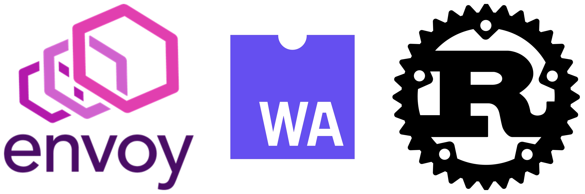

<!-- PROJECT LOGO -->
<br />
<p align="center">
  <a href="https://github.com/github_username/repo">
    
  </a>

  <h3 align="center">Envoy proxy authorization cache</h3>

  <p align="center">
   🛰 A POC to demonstrate possibility of implementing a local cache🛰️
    <br />
    <a href="#"><strong>Explore the docs »</strong></a>
    <br />
    <br />
    <a href="#">View Demo</a>
    ·
    <a href="#">Report Bug</a>
    ·
    <a href="#">Request Feature</a>
  </p>
</p>


<!-- TABLE OF CONTENTS -->
## Table of Contents

* [About the Project](#about-the-project)
* [Getting Started](#getting-started)
  * [Prerequisites](#prerequisites)
  * [Installation](#installation)
* [Basic overview](#Basic-overview)
* [Example demonstrations](#Example-demonstrations)
* [License](#license)
* [Contact](#contact)
* [Acknowledgements](#acknowledgements)


<!-- ABOUT THE PROJECT -->
## About The Project
**Simple POC for envoy local cache using a WASM HTTP filter and a singleton service that synchronize local cache with a global level management-service**
[![Product Name Screen Shot][product-screenshot]](https://example.com)

<!-- GETTING STARTED -->
## Getting Started

To get a local copy up and running follow these simple steps.

### Prerequisites

* docker
* docker-compose

####  Build Prerequisites for filters and singleton service
* Rust
* Cargo
* Make

### Installation
 
1. Clone the repo 
```sh
git clone https://github.com/NomadXD/commhawk.git
cd commhawk
```
2. Build the project with docker-compose
```sh
docker-compose build
```
3. Start the services with docker-compose
```sh
docker-compose up
```

## Basic overview

This simple POC comprises of 3 main components.
* 2 instances of envoy proxy as edge proxies with a custom HTTP filter and a singleton service built using WASM Rust SDK
* Backend service with 3 endpoints named `/foo`, `/bar` and `/baz`. (`/foo` and `/bar` are cacheable resources while `/baz` is not cacheable)
* Management service that holds the global rules for authorization.

The main intention of the POC is to demonstrate the capability of using a WASM HTTP filter and a singleton service to implement a local authorization cache in envoy that is periodically synced with a global management service. The following factors are considered when implementing the POC.

* A global level storage to store cache inside envoy where the cache is accessible from all the worker threads. Envoy has this support with their shared data feature. 
* A singleton service that periodically sends the local cache to a management service and then updates the local cache based on the response from the management service. Envoy supports singleton as a boostrap extension.
* A HTTP filter that is capabale of intercepting requests and performing authorization based on a local cache. If not found in local cache sends an HTTP call to the management service. HTTP filter should be able to update the cache when requests pass through the filter. Also the HTTP filter should be able to add response headers like rate limit headers. 

#### All these features are currently supported with envoy. But sending a HTTP request from a singleton service is currently broken for all the release versions of envoy. But the issue is fixed in the main and in the next release of envoy (1.18), this will be fixed. So for this POC, we are using the `envoyproxy/envoy-dev:latest` image.


<!-- ROADMAP -->
## Example demonstrations

This

See the [open issues](https://github.com/github_username/repo/issues) for a list of proposed features (and known issues).


<!-- CONTRIBUTING -->
## Contributing

Contributions are what make the open source community such an amazing place to be learn, inspire, and create. Any contributions you make are **greatly appreciated**.

1. Fork the Project
2. Create your Feature Branch (`git checkout -b feature/AmazingFeature`)
3. Commit your Changes (`git commit -m 'Add some AmazingFeature'`)
4. Push to the Branch (`git push origin feature/AmazingFeature`)
5. Open a Pull Request


<!-- LICENSE -->
## License

Distributed under the MIT License. See `LICENSE` for more information.


<!-- CONTACT -->
## Contact

Lahiru Udayanga - lahiru97udayanga@gmail.com
<!-- ACKNOWLEDGEMENTS -->
## Acknowledgements

* Dr. Dulani Meedeniya
Senior Lecturer,
Department of Computer Science and Engineering,
University of Moratuwa,
Sri Lanka
* Mr. Sachin Kahawala,
Mentor,
Department of Computer Science and Engineering,
University of Moratuwa,
Sri Lanka


<!-- MARKDOWN LINKS & IMAGES -->
<!-- https://www.markdownguide.org/basic-syntax/#reference-style-links -->
[contributors-shield]: https://img.shields.io/github/contributors/othneildrew/Best-README-Template.svg?style=flat-square
[contributors-url]: https://github.com/othneildrew/Best-README-Template/graphs/contributors
[forks-shield]: https://img.shields.io/github/forks/othneildrew/Best-README-Template.svg?style=flat-square
[forks-url]: https://github.com/othneildrew/Best-README-Template/network/members
[stars-shield]: https://img.shields.io/github/stars/othneildrew/Best-README-Template.svg?style=flat-square
[stars-url]: https://github.com/othneildrew/Best-README-Template/stargazers
[issues-shield]: https://img.shields.io/github/issues/othneildrew/Best-README-Template.svg?style=flat-square
[issues-url]: https://github.com/othneildrew/Best-README-Template/issues
[license-shield]: https://img.shields.io/github/license/othneildrew/Best-README-Template.svg?style=flat-square
[license-url]: https://github.com/othneildrew/Best-README-Template/blob/master/LICENSE.txt
[linkedin-shield]: https://img.shields.io/badge/-LinkedIn-black.svg?style=flat-square&logo=linkedin&colorB=555
[linkedin-url]: https://linkedin.com/in/othneildrew
[product-screenshot]: img/overview.png